# Entity Relationship Diagram (ERD) - FEdu System

This document provides the Entity Relationship Diagram (ERD) drawn in **PlantUML** format and detailed table structures for the FEdu (Education Management Platform) database schema.

The raw PlantUML file is stored at [diagram/erd.puml](file:///Users/mac/Documents/GitHub/SWP391_G1_FEdu_Be/diagram/erd.puml).

---

## 📊 ERD Diagram (PlantUML)

Below is the PlantUML source code representing the database schema. You can render this using any PlantUML editor, extension, or renderer.

```plantuml
@startuml

!theme plain
hide circle
skinparam linetype ortho

entity "user_account" as user_account {
  * user_id : BIGSERIAL [PK]
  --
  * email : VARCHAR(100)
  * password : VARCHAR(255)
  * last_name : VARCHAR(255)
  * first_name : VARCHAR(255)
  avatar_url : TEXT
  is_deleted : BOOLEAN
  * status : e_user_status
  gender : e_gender
  bod : DATE
  phone : VARCHAR(50)
  created_at : TIMESTAMP
  updated_at : TIMESTAMP
}

entity "roles" as roles {
  * role_id : BIGSERIAL [PK]
  --
  * role_name : e_role
  created_at : TIMESTAMP
  updated_at : TIMESTAMP
}

entity "user_role" as user_role {
  * user_role_id : BIGSERIAL [PK]
  --
  * user_id : BIGINT [FK]
  * role_id : BIGINT [FK]
}

entity "permissions" as permissions {
  * permission_id : BIGSERIAL [PK]
  --
  * permission_name : VARCHAR(100)
  description : VARCHAR(255)
  created_at : TIMESTAMP
  updated_at : TIMESTAMP
}

entity "role_permission" as role_permission {
  * role_permission_id : BIGSERIAL [PK]
  --
  * role_id : BIGINT [FK]
  * permission_id : BIGINT [FK]
  created_at : TIMESTAMP
}

entity "tokens" as tokens {
  * id : BIGSERIAL [PK]
  --
  * user_id : BIGINT [FK]
  access_token : TEXT
  refresh_token : TEXT
  reset_token : TEXT
  expired_at : TIMESTAMP
  is_revoked : BOOLEAN
  created_at : TIMESTAMP
  updated_at : TIMESTAMP
}

entity "subjects" as subjects {
  * subject_id : BIGSERIAL [PK]
  --
  * subject_code : VARCHAR(50)
  * subject_name : VARCHAR(255)
  description : TEXT
  created_by : BIGINT [FK]
  is_deleted : BOOLEAN
  created_at : TIMESTAMP
  updated_at : TIMESTAMP
}

entity "classrooms" as classrooms {
  * classroom_id : BIGSERIAL [PK]
  --
  * class_name : VARCHAR(255)
  semester : VARCHAR(50)
  description : TEXT
  is_deleted : BOOLEAN
  created_at : TIMESTAMP
  updated_at : TIMESTAMP
}

entity "classroom_subjects" as classroom_subjects {
  * id : BIGSERIAL [PK]
  --
  * classroom_id : BIGINT [FK]
  * subject_id : BIGINT [FK]
  * lecturer_id : BIGINT [FK]
  created_at : TIMESTAMP
  updated_at : TIMESTAMP
}

entity "classroom_subject_students" as classroom_subject_students {
  * id : BIGSERIAL [PK]
  --
  * classroom_subject_id : BIGINT [FK]
  * student_id : BIGINT [FK]
  current_level : INT
  is_submentor : BOOLEAN
  joined_at : TIMESTAMP
  created_at : TIMESTAMP
  updated_at : TIMESTAMP
}

entity "sub_mentor_student_assignment" as sub_mentor_student_assignment {
  * id : BIGSERIAL [PK]
  --
  * sub_mentor_css_id : BIGINT [FK]
  * student_css_id : BIGINT [FK]
  assigned_at : TIMESTAMP
  created_at : TIMESTAMP
  updated_at : TIMESTAMP
}

entity "learning_paths" as learning_paths {
  * path_id : BIGSERIAL [PK]
  --
  subject_id : BIGINT [FK]
  * path_name : VARCHAR(255)
  description : TEXT
  created_by : BIGINT [FK]
  classroom_id : BIGINT [FK]
  original_path_id : BIGINT [FK]
  is_deleted : BOOLEAN
  created_at : TIMESTAMP
  updated_at : TIMESTAMP
}

entity "learning_nodes" as learning_nodes {
  * node_id : BIGSERIAL [PK]
  --
  * path_id : BIGINT [FK]
  * title : VARCHAR(255)
  description : TEXT
  * node_type : e_node_type
  * node_status : e_node_status
  is_deleted : BOOLEAN
  created_at : TIMESTAMP
  updated_at : TIMESTAMP
}

entity "node_materials" as node_materials {
  * material_id : BIGSERIAL [PK]
  --
  * node_id : BIGINT [FK]
  * title : VARCHAR(255)
  required : BOOLEAN
  order_index : INT
  is_deleted : BOOLEAN
  created_at : TIMESTAMP
  updated_at : TIMESTAMP
}

entity "videos" as videos {
  * video_id : BIGSERIAL [PK]
  --
  * material_id : BIGINT [FK]
  * video_url : TEXT
  title : VARCHAR(255)
  duration_seconds : INT
  description : TEXT
  is_deleted : BOOLEAN
  created_at : TIMESTAMP
  updated_at : TIMESTAMP
}

entity "files" as files {
  * file_id : BIGSERIAL [PK]
  --
  * material_id : BIGINT [FK]
  * file_url : TEXT
  file_name : VARCHAR(255)
  file_type : VARCHAR(100)
  description : TEXT
  is_deleted : BOOLEAN
  created_at : TIMESTAMP
  updated_at : TIMESTAMP
}

entity "tests" as tests {
  * test_id : BIGSERIAL [PK]
  --
  * node_id : BIGINT [FK]
  * title : VARCHAR(255)
  description : TEXT
  duration_minutes : INT
  passing_percentage : DECIMAL(5,2)
  is_deleted : BOOLEAN
  created_at : TIMESTAMP
  updated_at : TIMESTAMP
}

entity "test_questions" as test_questions {
  * question_id : BIGSERIAL [PK]
  --
  * test_id : BIGINT [FK]
  * question_content : TEXT
  * question_type : VARCHAR(50)
  score : DECIMAL(5,2)
  created_at : TIMESTAMP
  updated_at : TIMESTAMP
}

entity "test_answers" as test_answers {
  * answer_id : BIGSERIAL [PK]
  --
  * question_id : BIGINT [FK]
  * answer_content : TEXT
  is_correct : BOOLEAN
  created_at : TIMESTAMP
  updated_at : TIMESTAMP
}

entity "student_test_attempts" as student_test_attempts {
  * attempt_id : BIGSERIAL [PK]
  --
  * test_id : BIGINT [FK]
  * student_id : BIGINT [FK]
  score : DECIMAL(5,2)
  started_at : TIMESTAMP
  submitted_at : TIMESTAMP
  created_at : TIMESTAMP
  updated_at : TIMESTAMP
}

entity "student_test_responses" as student_test_responses {
  * response_id : BIGSERIAL [PK]
  --
  * attempt_id : BIGINT [FK]
  * question_id : BIGINT [FK]
  selected_answer_id : BIGINT [FK]
  response_text : TEXT
  is_correct : BOOLEAN
  created_at : TIMESTAMP
  updated_at : TIMESTAMP
}

entity "student_selected_answers" as student_selected_answers {
  * response_id : BIGINT [PK, FK]
  * answer_id : BIGINT [PK, FK]
}

entity "student_node_progress" as student_node_progress {
  * progress_id : BIGSERIAL [PK]
  --
  * student_id : BIGINT [FK]
  * node_id : BIGINT [FK]
  * path_id : BIGINT [FK]
  * order_index : INT
  * status : VARCHAR(50)
  unlocked_at : TIMESTAMP
  completed_at : TIMESTAMP
  created_at : TIMESTAMP
  updated_at : TIMESTAMP
}

entity "submissions" as submissions {
  * submission_id : BIGSERIAL [PK]
  --
  * node_id : BIGINT [FK]
  * student_id : BIGINT [FK]
  graded_by : BIGINT [FK]
  title : VARCHAR(255)
  content : TEXT
  file_url : TEXT
  submission_status : e_submission_status
  grade : DECIMAL(5,2)
  feedback : TEXT
  is_deleted : BOOLEAN
  submitted_at : TIMESTAMP
  graded_at : TIMESTAMP
  created_at : TIMESTAMP
  updated_at : TIMESTAMP
}

entity "node_questions" as node_questions {
  * question_id : BIGSERIAL [PK]
  --
  * node_id : BIGINT [FK]
  * student_id : BIGINT [FK]
  * content : TEXT
  is_deleted : BOOLEAN
  created_at : TIMESTAMP
  updated_at : TIMESTAMP
}

entity "question_answers" as question_answers {
  * answer_id : BIGSERIAL [PK]
  --
  * question_id : BIGINT [FK]
  * lecturer_id : BIGINT [FK]
  * content : TEXT
  created_at : TIMESTAMP
  updated_at : TIMESTAMP
}

entity "node_reviews" as node_reviews {
  * review_id : BIGSERIAL [PK]
  --
  * node_id : BIGINT [FK]
  * student_id : BIGINT [FK]
  rating : INT
  content : TEXT
  is_deleted : BOOLEAN
  created_at : TIMESTAMP
  updated_at : TIMESTAMP
}

entity "support_tickets" as support_tickets {
  * ticket_id : BIGSERIAL [PK]
  --
  * classroom_subject_student_id : BIGINT [FK]
  * message_student : TEXT
  message_response : TEXT
  * status : VARCHAR(20)
  is_deleted : BOOLEAN
  created_at : TIMESTAMP
  updated_at : TIMESTAMP
}

' Relationships
user_account ||--o{ user_role
roles ||--o{ user_role
roles ||--o{ role_permission
permissions ||--o{ role_permission
user_account ||--o{ tokens
user_account ||--o{ subjects
classrooms ||--o{ classroom_subjects
subjects ||--o{ classroom_subjects
user_account ||--o{ classroom_subjects
classroom_subjects ||--o{ classroom_subject_students
user_account ||--o{ classroom_subject_students
classroom_subject_students ||--o{ sub_mentor_student_assignment : "sub_mentor_css"
classroom_subject_students ||--o{ sub_mentor_student_assignment : "student_css"
classroom_subject_students ||--o{ support_tickets
subjects ||--o{ learning_paths
classrooms ||--o{ learning_paths
user_account ||--o{ learning_paths
learning_paths ||--o{ learning_paths
learning_paths ||--o{ learning_nodes
learning_nodes ||--o{ node_materials
node_materials ||--o{ videos
node_materials ||--o{ files
learning_nodes ||--o{ tests
tests ||--o{ test_questions
test_questions ||--o{ test_answers
tests ||--o{ student_test_attempts
user_account ||--o{ student_test_attempts
student_test_attempts ||--o{ student_test_responses
test_questions ||--o{ student_test_responses
test_answers ||--o{ student_test_responses
student_test_responses ||--o{ student_selected_answers
test_answers ||--o{ student_selected_answers
user_account ||--o{ student_node_progress
learning_nodes ||--o{ student_node_progress
learning_paths ||--o{ student_node_progress
learning_nodes ||--o{ submissions
user_account ||--o{ submissions
user_account ||--o{ submissions
learning_nodes ||--o{ node_questions
user_account ||--o{ node_questions
node_questions ||--o{ question_answers
user_account ||--o{ question_answers
learning_nodes ||--o{ node_reviews
user_account ||--o{ node_reviews

@enduml
```

---

## 🛠️ Table Specifications & Descriptions

### 1. User & Access Module
* **`user_account`**: Stores credentials, profile data, gender, birthday, phone, and soft-delete status.
* **`roles`**: Contains security roles. Predefined entries: `ADMIN`, `TEACHER`, `STUDENT`, `SUB_MENTOR`, `USER`.
* **`user_role`**: Many-to-Many mapping linking users to system roles.
* **`permissions`**: Named fine-grained actions (e.g., `CREATE_CLASS`, `GRADE_ASSIGNMENT`).
* **`role_permission`**: Grants specific permissions to roles.
* **`tokens`**: Persists JWT access, refresh, and password-reset tokens with expiration and revocation flags.

### 2. Academic Module
* **`subjects`**: Available educational courses (e.g. `subject_code` like `PRJ301`, `PRU211`).
* **`classrooms`**: Standard academic groups (e.g. `class_name` like `SE1701`, `SE1802`).
* **`classroom_subjects`**: Links classrooms to subjects, designating a specific teacher (`lecturer_id`) as the instructor.
* **`classroom_subject_students`**: Represents students enrolled in a specific class-subject session.
* **`classroom_sub_mentor`**: Assigns sub-mentors (senior students/tutors) to assist in specific class-subjects.

### 3. Curriculum Module
* **`learning_paths`**: The chronological route of learning nodes. Can be cloned/forked (`original_path_id`) for classroom customizations.
* **`learning_nodes`**: Core milestones/lessons (e.g. "Arrays", "Database Joins") with properties for learning types (`AT_HOME`, `ON_CLASS`) and visibility (`LOCKED`, `OPEN`, `HIDDEN`).
* **`node_materials`**: Specific lesson tasks or resources inside a node.
* **`videos`**: Video links, titles, and durations tied to a specific lesson resource.
* **`files`**: Slide/PDF document attachments for student downloads.

### 4. Evaluation & Tracking Module
* **`tests`**: Automated quizzes tied to learning milestones.
* **`test_questions`**: Questions comprising a quiz (supports multiple-choice, essay, etc.).
* **`test_answers`**: Correct and incorrect options for the questions.
* **`student_test_attempts`**: Student attempts on a test, tracking time and score.
* **`student_test_responses`**: Records specific student responses for each question.
* **`student_selected_answers`**: Many-to-many relationship supporting multiple selected answers.
* **`student_node_progress`**: Tracks path completion status (`LOCKED`, `COMPLETED`, etc.) for student dashboards.
* **`submissions`**: Homework/hand-in assignments uploaded by students, graded by teachers/sub-mentors.

### 5. Interaction & Q&A Module
* **`node_questions`**: Discussions or questions posted by students regarding a specific lesson.
* **`question_answers`**: Official answers written by the teacher.
* **`node_reviews`**: Ratings (1 to 5 stars) and qualitative feedback from students.
* **`support_tickets`**: Peer-mentoring support tickets. Student sends a question (NONE), sub-mentor responds (DONE) or escalates to lecturer (SEND), lecturer resolves (DONE).
* **`sub_mentor_student_assignment`**: Maps a sub-mentor CSS to student CSSes in the same class-subject for peer mentoring.
